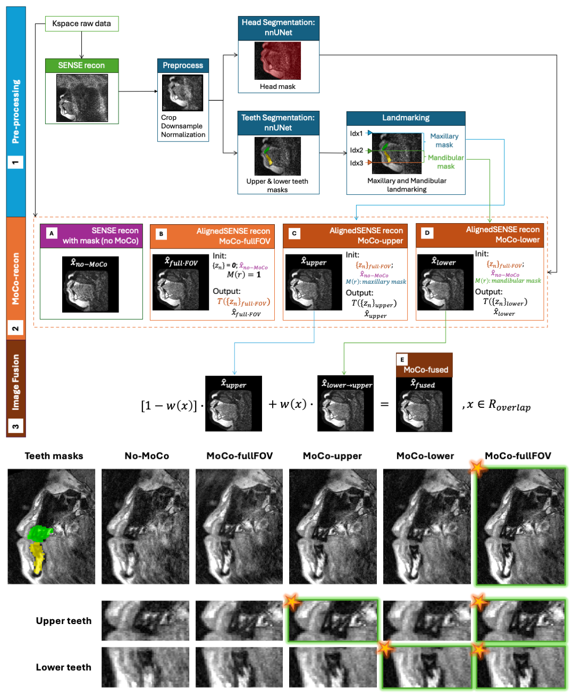

# Motion-Robust Dental MRI for Paediatric Dental Trauma

This repository contains the main reconstruction and workflow code accompanying our paper:

**Motion-Robust Dental MRI for Imaging of Paediatric Dental Trauma**

In the paper, we describe the proposed method as a **region-adaptive motion correction reconstruction tailored to dental MRI**. 



The proposed automated region-adaptive motion-correction reconstruction identifies maxillary and mandibular regions, performs region-specific motion estimation and correction, and fuses the corrected regions into a single image for clinical review. 

The core workflow is implemented in [batch_dental_multiple.m](https://github.com/ZihanNing/dental_MRI_motion_correction/blob/main/batch_dental_multiple.m), while the main reconstruction routines remain in this Git repository.

## Repository Contents

- `batch_dental_multiple.m`: end-to-end batch workflow for case processing
- `deployRecon_dental_SENSE.m`: baseline SENSE reconstruction
- `deployRecon_dental_MoCo.m`: region-adaptive motion-correction reconstruction
- `zihan_tools/image_fusion.m`: fusion of upper-jaw and lower-jaw MoCo reconstructions and other dependent scripts
- `Python/`: preprocessing, intensity normalization, and mask restoration scripts for nnUNet-based segmentation
- `brackenier-tools/` and `dhcp-repo-release07/`: code dependencies included with this repository for motion-correction reconstruction

## Release Plan

The full open-source release is split across three locations:

- **GitHub repository**: MATLAB workflow, reconstruction code, and utility scripts
- **Hugging Face**: trained nnUNetv2 models for head segmentation and teeth segmentation
- **Zenodo**: demo cases for testing the released pipeline

Release links will be added here when public:

- Hugging Face models: `TBD`
- Zenodo demo cases: `TBD`

## Requirements

### MATLAB

The workflow has been run on **MATLAB R2019a** on our server.

At minimum, the current workflow expects MATLAB with NIfTI and image-processing functionality used by:

- `niftiinfo`, `niftiread`, `niftiwrite`
- `imgaussfilt3`
- `imregtform`
- `imwarp`
- `imref3d`
- `bwdist`

In practice, **Image Processing Toolbox** is required for the segmentation post-processing and image-fusion steps.

Some reconstruction code paths in this repository also use GPU-aware MATLAB arrays (`gpuArray`). A GPU is not strictly required for every script, but it may be important for practical reconstruction speed depending on your setup.

### Python

The segmentation preprocessing and mask restoration scripts in `Python/` require Python packages including:

- `numpy`
- `scipy`
- `nibabel`

These scripts are called from MATLAB in `batch_dental_multiple.m`.

### nnUNetv2

To run the segmentation-enabled workflow, you will need **nnUNetv2** installed in a Python environment.

Essential links:

- nnUNet repository: [MIC-DKFZ/nnUNet](https://github.com/MIC-DKFZ/nnUNet)
- nnUNetv2 installation and setup: [official installation guide](https://github.com/MIC-DKFZ/nnUNet/blob/master/documentation/getting-started/installation-and-setup.md)
- PyTorch installation: [PyTorch local installation guide](https://pytorch.org/get-started/locally/)

The current batch script assumes:

- a Conda environment name such as `nnunetv2`
- `nnUNetv2_predict` is available in that environment
- nnUNet paths are configured via `nnUNet_raw`, `nnUNet_preprocessed`, and `nnUNet_results`

In [batch_dental_multiple.m](./batch_dental_multiple.m), these are currently set through the local variables `CONDA`, `ENVNAME`, and `NNUNET_BASE`. You will likely need to edit these paths for your system before running the workflow.

### Trained Model Weights

The repository does **not** store the trained nnUNet model weights directly. Instead, the trained models for:

- teeth segmentation
- head segmentation

will be distributed separately on Hugging Face. After downloading them, place them into the nnUNet results structure expected by your local nnUNetv2 installation.

## Installation

Clone the repository and add it to your MATLAB path. The workflow already uses:

```matlab
addpath(genpath(pwd))
```

so the included helper code under this repository is made available automatically when launched from the project root.

If you are preparing a fresh environment, make sure the following are ready before running the batch workflow:

1. MATLAB R2019a or a compatible MATLAB release
2. Image Processing Toolbox
3. A Python environment with `numpy`, `scipy`, and `nibabel`
4. nnUNetv2 installed and callable from that environment
5. The released head and teeth nnUNet model weights downloaded from Hugging Face

## Data Layout

The batch workflow expects case folders under `Studies-deploy/`, for example:

```text
Studies-deploy/
  1/
    *.dat
  2/
    *.dat
```

During processing, outputs are written into folders such as:

- `An-Aq/`: baseline reconstruction and segmentation-related intermediates
- `An-Ve/`: motion-corrected reconstructions and fused images
- `An-Aq/seg/`: restored head and teeth masks used by the workflow

## Quick Test with Demo Cases

We will provide demonstration cases through Zenodo so users can test the released workflow without preparing their own dataset first.

Recommended quick-start:

1. Download and unpack the demo data from Zenodo.
2. Place the demo case folders inside `Studies-deploy/`.
3. Download the trained nnUNet models from Hugging Face and install them into your local nnUNetv2 setup.
4. Open [batch_dental_multiple.m](https://github.com/ZihanNing/dental_MRI_motion_correction/blob/main/batch_dental_multiple.m) in MATLAB.
5. Update the local configuration as needed: `rootFolder`, `caseList`, `seqSelect`, `CONDA`, `ENVNAME`, and `NNUNET_BASE`.
6. Run `batch_dental_multiple`.

For a minimal test, start with a single case:

```matlab
rootFolder  = './Studies-deploy';
caseList    = [1];
seqSelect   = {'MPRAGE','T2wSPACE','PDwSPACE'};
```

## What the Batch Workflow Does

For each selected case and sequence, `batch_dental_multiple.m` performs:

1. baseline SENSE reconstruction
2. preprocessing for nnUNet inference
3. teeth segmentation
4. head segmentation
5. restoration of masks to the original resolution and field of view
6. landmark extraction from the teeth mask
7. region-specific motion-corrected reconstruction
8. fusion of upper-jaw and lower-jaw motion-corrected images

The fused image is saved in `An-Ve/` together with the other reconstruction outputs.

## Notes on Current Configuration

This repository currently includes some environment-specific paths in the MATLAB scripts, for example Conda and nnUNet installation locations. These should be treated as templates and adapted locally before use.

The present workflow has been developed and tested in our server environment. If you are porting it to a new machine, the main things to check first are:

- MATLAB version and toolbox availability
- Python environment activation
- nnUNetv2 installation and path variables
- location of downloaded trained weights
- case folder layout under `Studies-deploy/`

## Acknowledgements

This repository builds on included code from:

- `brackenier-tools`
- `dhcp-repo-release07`

We thank the original contributors to those components.

## Citation

If you use this code, please cite the accompanying paper:

**Motion-Robust Dental MRI for Imaging of Paediatric Dental Trauma**

Citation details will be added here upon publication.

## Contributors

Zihan Ning and collaborators.

## License

License information will be added as part of the public release.
